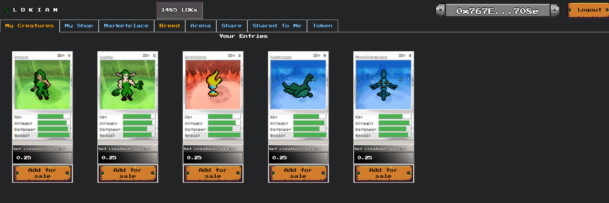

# [Lokian.monster](https://lokian.monster) : A landing page for Lokian trading card game with NFTs, share, fight and breed monsters in solidity blockchains.

# [Lokian.eth](https://github.com/tytzM17/Lokian.eth) 
## The main app github page for Lokian trading card game with NFTs, share, fight and breed monsters in solidity blockchains.

# [BSC.lokian.monster](https://github.com/tytzM17/bsc.lokian.monster) 
## The BSC main app github page for Lokian trading card game with NFTs, share, fight and breed monsters in solidity blockchains.

 

***

This project was developed as a module coursework.

Thanks to Stamatis Kourkotas from

**Imperial College London:** MSc in Computing (Software Engineering) 
**Module:** Principless of Distributed Ledgers 
**Project Description:** Found in included [report](./report.pdf) 

This project was bootstrapped with [Create React App](https://github.com/facebook/create-react-app).

## Steps for deployment and use of our site

- In the project directory run:

    **`npm install`** This installs all the necessary dependencies to build our application
    
    **`npm start`** This runs the app in development mode. 

- Open [http://localhost:3000](http://localhost:3000) to view it in the browser. You can see all the Creatures owned by the current metamask account and play the game.

## Addendum 
- 09/16/2023, New section for news and updates, with images, topic and date.

